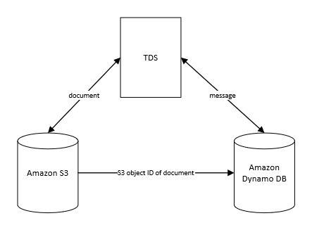

Requirements
============

Data used by the TDS must be persisted to stable storage during the
lifetime of the exchange (in case of TDS system crash) and beyond (in
order to resolve any potential disputes).

An exchange may take place over several days (typical quote acceptance
terms, for example, are 30 days).

During the exchange
-------------------

-   **Documents** sent between participants must be stored for the
    lifetime of the exchange

-   It must not be possible for any participant to obtain a document
    without going through the exchange protocol interfaces

-   It must not be possible for a participant to obtain a document or
    information from any other exchange

-   The current state (identifier and step) of any exchange must be
    stored for the lifetime of the exchange

After the exchange
------------------

-   An audit trail of the **Messages** sent between the participants
    must be kept for a period after the exchange has completed

Sizing
------

Some example document sizes:

| 12 page academic paper in PDF format  | 2 MB  |
|---------------------------------------|-------|
| 1920x1080 bitmap image, 24 bit colour | 6 MB  |
| 54 slide lecture notes in PowerPoint  | 10 MB |
| 738 page textbook in PDF format       | 15 MB |
| 63 slide lecture notes in PDF format  | 30 MB |

Document storage per day = exchanges per day\*document size

|                     |        |       |         |          |           |             |
|---------------------|--------|-------|---------|----------|-----------|-------------|
|                     |Document size (MB) | 2     | 6       | 10       | 15        | 30          |
| Exchanges per day   |        |       |         |          |           |             |
|                     | 1000   | 2GB   | 12GB    | 120GB    | 1,800GB   | 54,000GB    |
|                     | 2000   | 4GB   | 24GB    | 240GB    | 3,600GB   | 108,000GB   |
|                     | 5000   | 10GB  | 60GB    | 600GB    | 9,000GB   | 270,000GB   |
|                     | 10000  | 20GB  | 120GB   | 1,200GB  | 18,000GB  | 540,000GB   |
|                     | 20000  | 40GB  | 240GB   | 2,400GB  | 36,000GB  | 1,080,000GB |
|                     | 50000  | 100GB | 600GB   | 6,000GB  | 90,000GB  | 2,700,000GB |
|                     | 100000 | 200GB | 1,200GB | 12,000GB | 180,000GB | 5,400,000GB |

Even for small documents, the storage requirements can increase quickly
with more usage of the system.

Amazon Services
===============

Storage
-------

**Amazon S3** (Amazon Simple Storage Service) is object storage with a
simple web service interface to store and retrieve any amount of data
from anywhere on the web.

-   supports data transfer over SSL and automatic encryption of data

-   can configure bucket policies to manage object permissions and
    control access to data using AWS Identity and Access
    Management (IAM). IAM enables organizations to create and manage
    multiple users under a single AWS account. With IAM policies, you
    can grant IAM users fine-grained control to your Amazon S3 bucket
    or objects. You can use ACLs to selectively add (grant) certain
    permissions on individual objects

-   supports query string authentication

-   deeply integrated with other AWS services including Amazon RDS,
    Amazon EBS and Amazon DynamoDB

**Amazon EFS** (Amazon Elastic File System) provides simple, scalable
file storage for use with Amazon EC2 instances.

-   Multiple Amazon EC2 instances can access an Amazon EFS file system
    at the same time

-   Amazon EFS does **not** currently provide the option to encrypt data
    at rest

-   can control which Amazon EC2 instances can access the file system by
    creating “mount targets.” Only resources that can access a mount
    target can access the file system

-   can control who can administer your file system using AWS Identity
    and Access Management (IAM). You can control access to files and
    directories with POSIX-compliant user and group-level permissions

**Amazon EBS** (Amazon Elastic Block Store) provides persistent block
storage volumes for use with Amazon EC2 instances.

-   Amazon EBS encryption offers seamless encryption of EBS data
    volumes, boot volumes and snapshots

-   Access to Amazon EBS volumes is integrated with AWS Identity and
    Access Management

EFS vs EBS (from https://aws.amazon.com/efs/details/)

|                   |                         | Amazon EFS                                                                                            | Amazon EBS PIOPS                                                        |
|-------------------|-------------------------|-------------------------------------------------------------------------------------------------------|-------------------------------------------------------------------------|
| Performance       | Per-operation latency   | Low, consistent                                                                                       | Lowest, consistent                                                      |
|                   | Throughput scale        | Multiple GBs per second                                                                               | Single GB per second                                                    |
| Characteristics   | Data Availability/Durability  | Stored redundantly across multiple Availability Zones                                                 | Stored redundantly in a single Availability Zone                        |
|                   | Access                  | 1 to 1000s of EC2 instances, from multiple Availability Zones, concurrently                           | Single EC2 instance in a single Availability Zone                       |
|                   | Use Cases               | Big Data and analytics, media processing workflows, content management, web serving, home directories | Boot volumes, transactional and NoSQL databases, data warehousing & ETL |

|                              | Free Tier Capacity (GB) | Price ($/GB) per month |
|------------------------------|-------------------------|------------------------|
| Amazon S3                    | 5                       | 0.0125                 | 
| Amazon EFS                   | 5                       | 0.33                   |
| Amazon Elastic Block Storage | 30                      | 0.028                  |

Notes:

1.  Standard - Infrequent Access Storage, EU (Ireland) Region pricing

2.  EU (Ireland) Region pricing

3.  Amazon EBS Cold HDD (sc1) volumes, EU (Ireland) Region pricing

Database
--------

**Amazon RD**S (Amazon Relational Database Service) provides six
database engines to choose from, including MySQL, Oracle, and Microsoft
SQL Server.

**Amazon DynamoDB** is a NoSQL database service supporting both document
and key-value data structures.

-   Using the AWS SDK you can write applications that store JSON
    documents directly into Amazon DynamoDB tables

-   Amazon DynamoDB supports key-value data structures. Each item (row)
    is a key-value pair where the primary key is the only required
    attribute for items in a table and uniquely identifies each item.
    DynamoDB is schema-less. Each item can have any number of
    attributes (columns).

|               | DB model   | Free Tier Capacity                    | Storage Price ($/GB) per month |
|---------------|------------|---------------------------------------|--------------------------------|
| Amazon RDS    | Relational | 20GB,750 Hours per month of database usage  | 0.127                          |
| Amazon Dynamo | NoSQL      | 25GB,200M requests per month                | 0.283                         |

Notes:

1.  Single Availability Zone deployment, EU (Ireland) Region pricing

2.  EU (Ireland) Region pricing

Design Decisions
================

**Documents** are likely to have very high storage requirements, even
though they are not required to be stored beyond the end of the
exchange. Per GB, database storage is 5-20 times more expensive than
filesystem-type storage. Therefore:

-   **Documents will be stored in a filesystem, not a database**

Amazon EBS is linked to a single EC2 instance; this is not scalable, as
future growth in usage of the TDS service may require additional EC2
instances.

Amazon EFS may be shared by many EC2 instances, but is more expensive
per GB than database storage. It also doesn’t currently support
automatic encryption of data at rest, which would be a useful feature to
prevent access to documents without going through the TDS.

Amazon S3 may be accessed by many EC2 instances, and has the cheapest
storage price per GB (though there is less storage available in the free
tier). It supports automatic encryption and several access control
methods. In normal operation each document is written to storage once
and retrieved once, and neither requires great speed or low latency.

Therefore:

-   **Amazon S3 will be used for Document storage**

The current state of any exchange, the rest of the **Message**, and the
location of the Document, will be stored in a database to allow random
access by a participant in any exchange.

The TDS may be extendable to support other fair-exchange protocols. In a
relational database, this would likely require changes to the existing
DB schema. NoSQL databases whether key-value pair or document-based are
more flexible. However Amazon DynamoDB is more expensive than Amazon
RDS.

Proposal:

-   **Use DynamoDB for its flexibility, despite the extra cost**

Interfaces will be designed to decouple the implementation details
(storage vs database) from the TDS.

Diagram
=======

Schema
======

There are 3 tables:

User Registry
-------------

User ID  | Public Key
---------|------------
Alice    | xAg1FWs34*^s
Bob      | ...

Exchange State
--------------

Label   | Sender | Receiver | Protocol     | Step Number | Last Message     | Document ID
--------|--------|----------|--------------|-------------|------------------|----------------------
Label 1 | Alice  | Bob      | CoffeySaidha | 2           | SigAlice(h(doc)) | {S3 object ID of doc}
Label 2 | Chen   | Daoud    | CoffeySaidha | ...         | ...              | ...

Message Log
-----------

Label   | Sender | Receiver  | Protocol     | Step Number | Message
--------|--------|-----------|--------------|-------------|-----------------------
Label 1 | Alice  | Bob       | CoffeySaidha | 0           | {request for exchange}
Label 1 | Alice  | Bob       | CoffeySaidha | 1           | SigAlice(h(doc))
Label 1 | Alice  | Bob       | CoffeySaidha | 2           | SigAlice(h(doc))
Label 1 | Alice  | Bob       | CoffeySaidha | 3           | ...

Some notes on this:

I've added a **Protocol** column, at the moment we are only expecting to develop the CoffeySaidha protocol.  If our system can be extended to use different protocols, then we would need to know which one the clients are using.

I'm not sure yet what we need to store for sender and receiver in each column, is it the overall sender (always Alice) and overall receiver (always Bob) or the sender and receiver of that particular message (so for step 3, Bob is the sender and Alice via TTP is the receiver).

Storage API
===========

The database/storage solution will be used via the following interfaces:

`registerUser(userId, publicKey)`

Add a new user to the registry (return success/failure).

`getUserKey(userId)`

If the user exists in the registry return their public key.

`storeMessage(label, sender, receiver, protocol, step, message)`

1. Store the message details in the messsage log
2. Update the current state of the exchange `label`
3. Return success/failure

`storeMessage(label, sender, receiver, protocol, step, message, document)`

Overloaded version of storeMessage, takes an extra parameter containing the document.

1. Store the document in S3 and obtain its S3 Object ID
2. Store the message details in the messsage log
3. Update the current state of the exchange `label` including the S3 Object ID of the document
4. Return success/failure

`getState(label)`
Return a record structure containing the current state of exchange `label` or null if none found.

